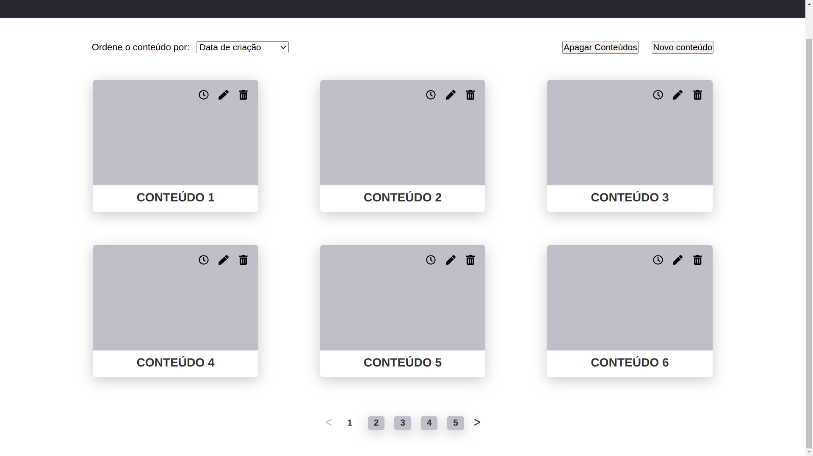

# Desafio Motrix

O desafio proposto foi o desenvolvimento de uma ferramenta simples para gestão de conteúdos
utilizando Node.js e React.

Como requisitos principais, temos:
- Criar, editar, listar, visualizar e apagar conteúdos;
- Visualizar o histórico de modificações de cada conteúdo.

Requisitos bônus:
- [x] Ordenação de conteúdos na lista por título, data de criação e data de atualização;
- [x] Operação em lote para apagar múltiplos conteúdos de uma vez a partir da lista;
- [ ] Paginação de conteúdos na listagem.



# Tecnologias usadas

* React
* Redux
* Redux toolkit
* Sass

<br>

# Rodando o projeto

  1. Clone o repositório:
  ```
  git clone git@github.com:riquelmebandeira/desafio-motrix-front.git
  cd desafio-motrix-front
  ```

  2. Instale as dependências:
  ```
  npm install
  ```

  3. Rode a aplicação com o comando:
  ```
  npm start
  ```